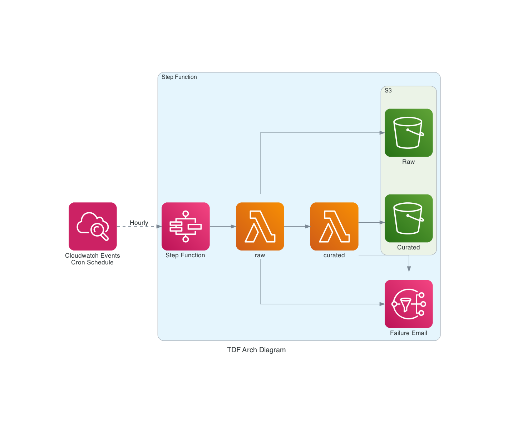

# TDF - API Ingestion Challenge

This code deploys a lambda pipeline using AWS CDK. 

## Design Notes

The challenge calls for a lambda function which collects data from an api that is periodically called (using Cloud Watch), and the data stored in S3.

In addition to this I have added components to turn this into a data pipeline:
* Two buckets, one for a raw zone, one for a curated zone, values passed into environment variables of lambda
* IAM policies to grant least privledges
* Lambda layer of pyarrow to allow for conversion of API data to parquet
* Use of Secrets Manager to store API key (secret is set via AWS CLI)
* Uses DESTROY policies to delete components (including S3 buckets and associated data) upon calling cdk destroy
* Step function to manage the flow and allow for error notifications

### Pipeline functionality:
* Retrieves API secret from secret manager
* Queries the API
* Retries API a number of times in the case the API is down. Skips the hour if the API is not available
* Saves the raw result to a raw s3 bucket
* Converts the API result into parquet format
* Saves to S3 curated bucket
* If the jobs fails an email notification is sent via SNS

### Next Steps:
* Adding a Glue database and a Glue Crawler to make this data queryable via Athena
  * AWS CDK Glue components are still in alpha stage, so are not used due to potential instability

## Architecture


## Notes and Assumptions

* The API can drop from time to time, so need to control for that within limits. 
  * If fails more than 3 times, then gracefully exit and try again on next schedule
* The API key is sensitive and as such needs to be stored securely
  * Is stored in AWS Secret Manager. You can either get your own free key from the API [provider](https://www.weatherapi.com), or contact the developer of this repo.
  * Due to security issues this is not stored in the code and needs to be deleted manually
* A bash script is used to add key to KMS so that it isn't stored in Github, nor is it logged in the CloudFormation logs
* Assume that everything fails all the time
  * Retry the api
  * Allow for failing gracefully if it doesn't work within the retry bounds
  * Store the raw JSON as a backup if there is an error in the parquet processing
* Use least permissions
* The data in the raw bucket is likely to not be used frequently so a lifecycle rule has been added to move to infrequent access (IA tier) after 30 days
* For simplicity of deployment, environment and account info is not set in app.py
* This data may have an SLA, hence the need for notification upon failure
  
# CDK Notes, Installation and Setup

The `cdk.json` file tells the CDK Toolkit how to execute your app.

This project is set up like a standard Python project.  The initialization
process also creates a virtualenv within this project, stored under the `.venv`
directory.  To create the virtualenv it assumes that there is a `python3`
(or `python` for Windows) executable in your path with access to the `venv`
package. 

To manually create a virtualenv on MacOS and Linux:

```
$ python3 -m venv .venv
```

After the init process completes and the virtualenv is created, you can use the following
step to activate your virtualenv.

```
$ source .venv/bin/activate
```

If you are a Windows platform, you would activate the virtualenv like this:

```
% .venv\Scripts\activate.bat
```

Once the virtualenv is activated, you can install the required dependencies.

```
$ pip install -r requirements.txt
```

Get the shell scripts ready to run.

```
chmod 755 ./set_key.sh
chmod 755 ./destroy.sh
```

Now you want to set the secrey key in secrets manager using the following file. Note that the secret name is set in this file and is used again in the `destroy.sh` file so if you want to change the name, you should update both files.

```
./set_key.sh
```

At this point you can now synthesize the CloudFormation template for this code.

```
$ cdk synth
```

## Deploying
You can add your email in this parameter should you wish to subscribe to the SNS topic and receive failure notifications.
```
cdk deploy --parameters emailParam='your@email.com.au'
```

## Destroying

To destroy the Cloud Formation stack run the following code.

```
cdk destroy
```

If you want to get rid of the api key at the same time as the Cloud Formation Stack you can run the destroy shell script instead.
```
./destroy.sh
```

## Useful commands

 * `cdk ls`          list all stacks in the app
 * `cdk synth`       emits the synthesized CloudFormation template
 * `cdk deploy`      deploy this stack to your default AWS account/region
 * `cdk diff`        compare deployed stack with current state
 * `cdk docs`        open CDK documentation

Enjoy!
